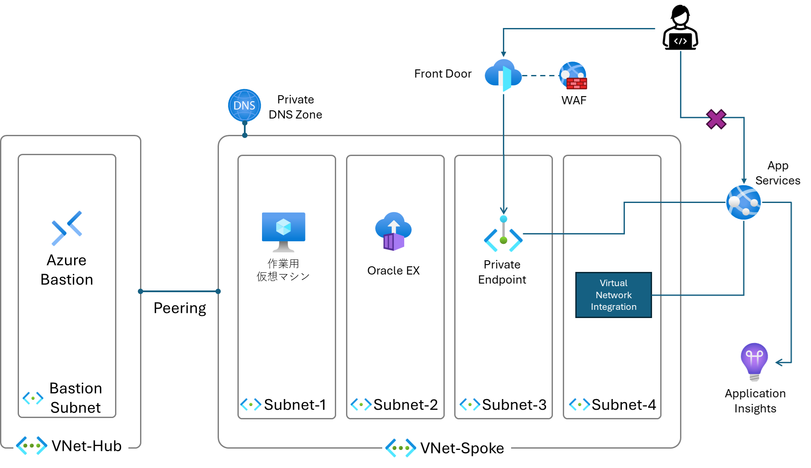

# Paas-AppService-Handson

## 概要

このハンズオンは、Azure App Serviceを利用してWebアプリケーションをデプロイする手順を学ぶことができます。

## 前提条件

- Azureアカウントを持っていること
- Azure CLIがインストールされていること
- Visual Studio Codeがインストールされていること
- Gitがインストールされていること
- GitHubアカウントを持っていること
- Java 17がインストールされていること

## 最終構成図

## 目次

- [Exersise 1 - 開発環境の準備](./documents/Exercise%201.md)
- [Exercise 2 - Azure App Serviceの作成とデプロイ](./documents/Exercise%202.md)
- [Exercise 3 - GitHub ActionsでのCI/CDの設定](./documents/Exercise%203.md)
- [Exercise 4 - Azure App Serviceのスロットリングの設定](./documents/Exercise%204.md)
- [Exercise 5 - FrontDoor + App Serviceの構成](./documents/Exercise%205.md)
- [Exercise 6 - Application Insightsの設定](./documents/Exercise%206.md)
- [Exercise 7 - Easy Authによる認証](./documents/Exercise%207.md)

## 参考資料
[App Service の概要](https://learn.microsoft.com/ja-jp/azure/app-service/overview)