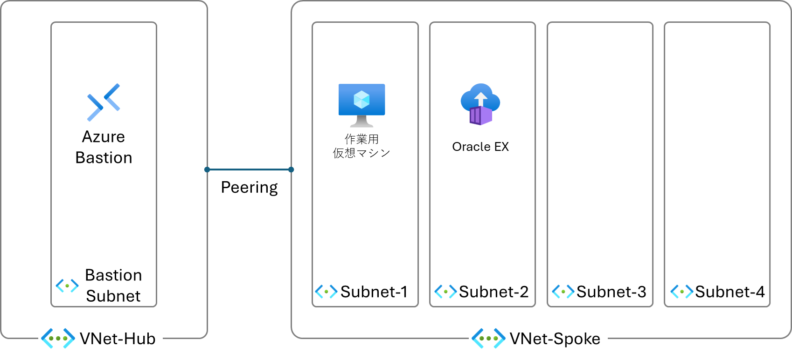

# 事前準備

## 事前準備完了後のリソース構成


## 環境構築

### 1. リポジトリのクローン

```bash
git clone https://github.com/h-morozumi/Paas-AppService-Handson.git
```
```bash
cd Paas-AppService-Handson
```

### 2. リソースの展開

Azure CLIを使用して、リソースを展開します。
事前にAzure CLIをインストールしてください。

[Windows での Azure CLI のインストール](https://learn.microsoft.com/ja-jp/cli/azure/install-azure-cli-windows?tabs=azure-cli)

```bash
az upgrade
```

#### Azureにログイン

```bash
az login --tenant <テナントID>
```
#### リソース グループの作成

```bash
az group create --name <リソース グループ名> --location westus
```

#### リソースの展開
```bash
az deployment group create --resource-group <リソース グループ名> --template-file ./template/bicep/modules/virtualnetwork_spoke.bicep --parameters ./template/bicep/parameters/virtualnetwork_spoke.bicepparam
```

```bash
az deployment group create --resource-group <リソース グループ名> --template-file ./template/bicep/templates/bastion.bicep --parameters ./template/bicep/parameters/bastion.bicepparam
```

### 3. データベースの作成

今回は、Oracle Express Editionを使用します。Oracle Databaseのコンテナイメージを使用して、Oracle Databaseをデプロイします。

```bash
az deployment group create --resource-group <リソース グループ名> --template-file ./template/bicep/modules/container_instance.bicep --parameters ./template/bicep/parameters/container_instance.bicepparam
```

#### サンプルスキーマを作成

```bash
az container exec -g <リソース グループ名> --name <コンテナ名>  --exec-command "/bin/bash"
```

```bash
curl -o ./scott.sql  "https://raw.githubusercontent.com/h-morozumi/Paas-AppService-Handson/refs/heads/main/template/sql/scott.sql"
```

```bash
sqlplus SYSTEM/password@XEPDB1 @./scott.sql
```

```bash
sqlplus SCOTT/tiger@XEPDB1
```

```bash
SELECT EMPNO, ENAME FROM EMP;
```

## リソースプロバイダーの登録

- Microsoft.Cdn

