# Exercise 3 - GitHub ActionsでのCI/CDの設定

## 目次

- [1. App Service への継続的デプロイの設定](#1-app-service-への継続的デプロイの設定)
- [2. ワークフローの修正](#2-ワークフローの修正)
- [3. アプリケーションの更新](#3-アプリケーションの更新)
- [4. ワークフローの実行](#4-ワークフローの実行)

## 概要

この演習では、GitHub Actions を使用して、Azure App Service に Java アプリケーションをデプロイする CI/CD パイプラインを構築します。

## 1. App Service への継続的デプロイの設定

管理ブレードから「デプロイセンター」を選択し、デプロイ方法を設定します。

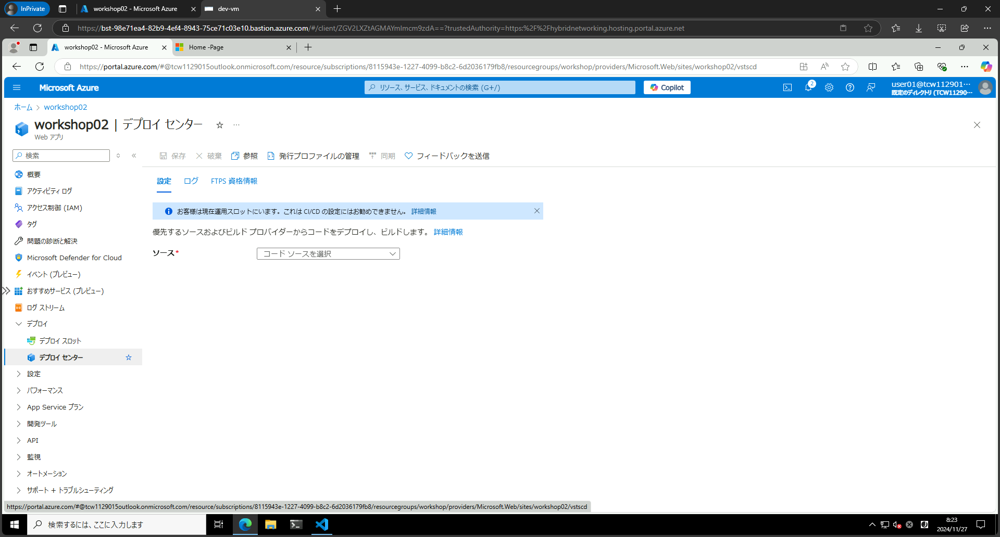

「GitHub」を選択し、GitHub の認証を行います。認証が完了したら「保存」をクリックします。
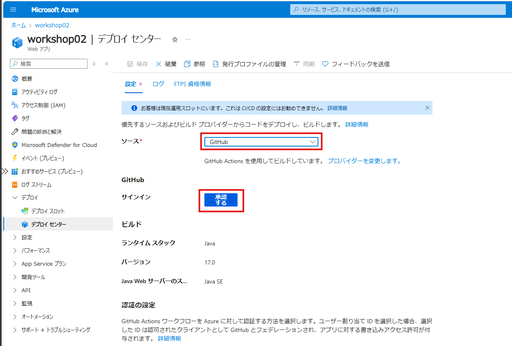
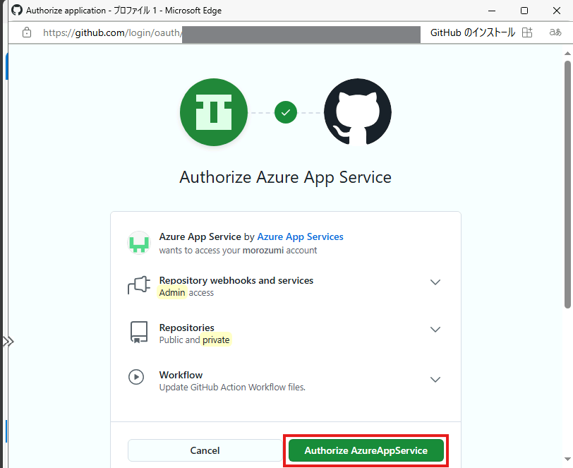
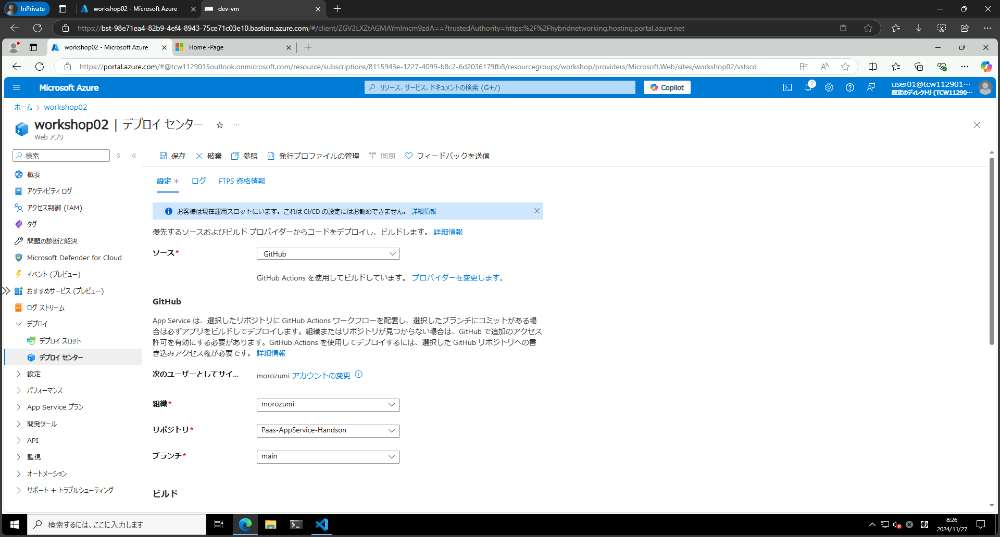
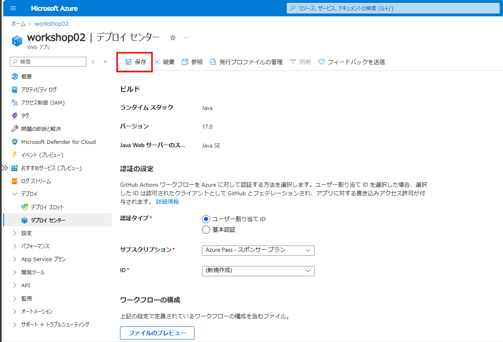
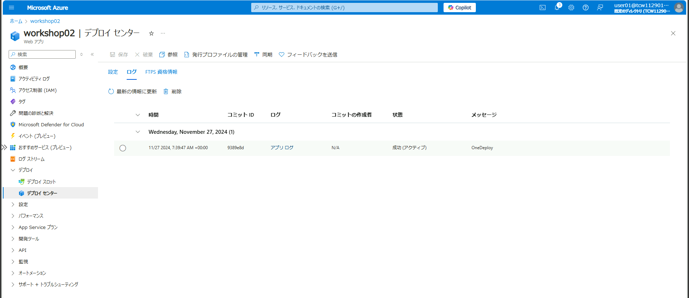

以上、App Service への継続的デプロイの設定が完了しました。

## 2. ワークフローの修正

デプロイセンターの設定が完了したら、GitHub Actions のワークフローを修正します。
リポジトリに「.github/workflows」ディレクトリが作成され、「main_xxxxxx.yml」ファイルが作成されていることを確認します。
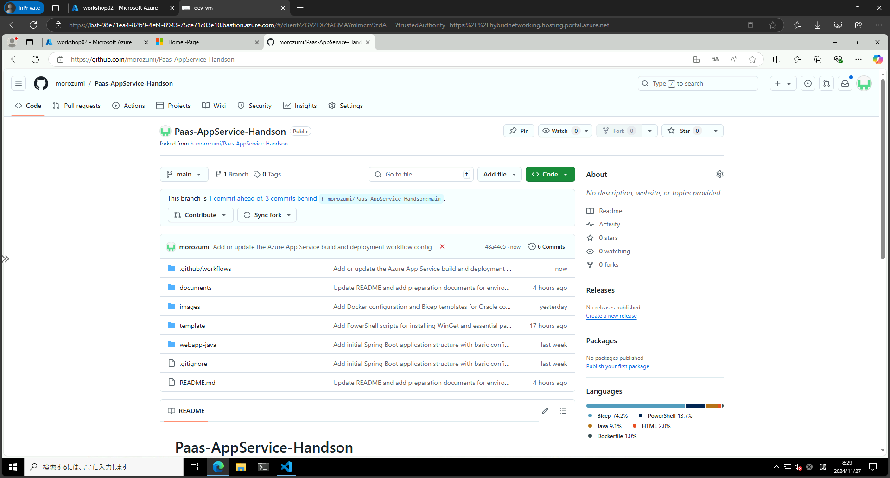
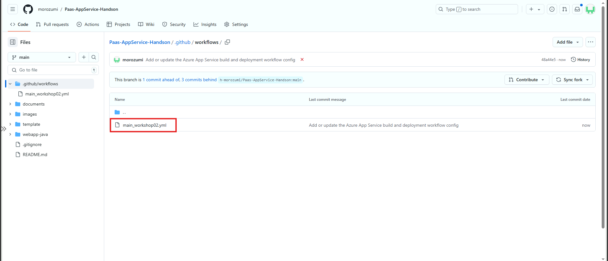

「Settings」をクリックし、「Secrets and variables」に移動します。環境変数が3つ追加されました。
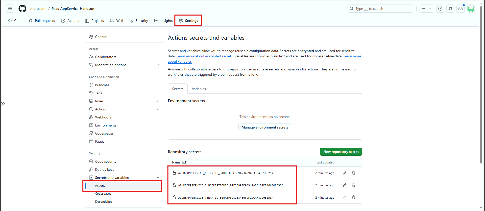

「Actions」をクリックし、ワークフローを確認します。エラーが発生しているので内容を確認します。


「build」をクリックすると、エラーの詳細を確認できます。
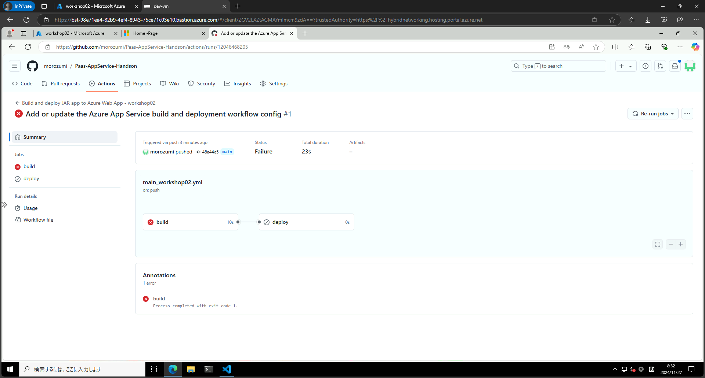

POMファイルが見つからず、ビルドエラーとなっていることがわかります。ワークフローを修正して、ビルドが成功するようにします。
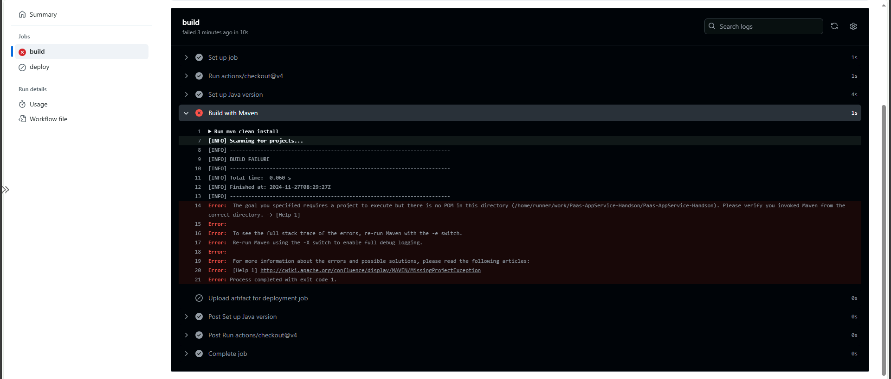

GitHubから最新のコードを取得し、ワークフローを修正します。

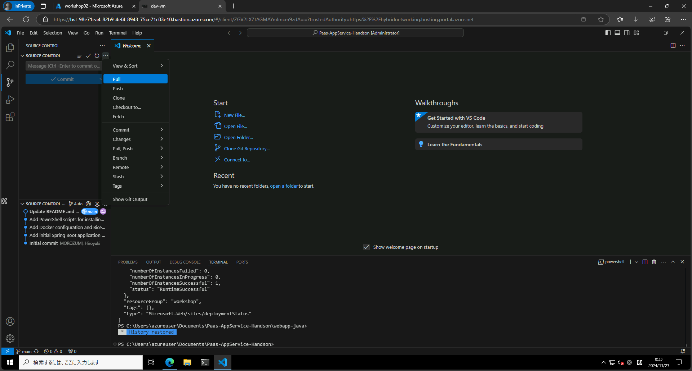

ワークフローを修正します。
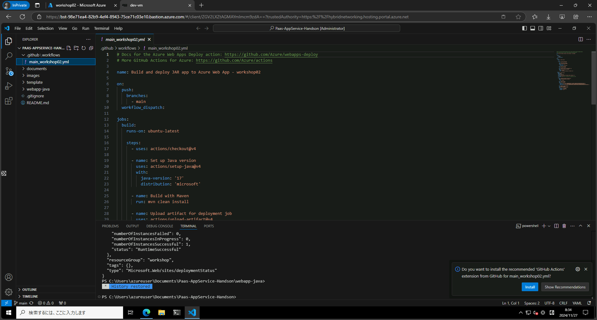


6行目
```yaml
on:
  # push:
  #   branches:
  #     - main
  workflow_dispatch:
```

12行目
```yaml
env:
  APP_PATH: "webapp-java"
```

29行目
```yaml
      - name: Build with Maven
        run: cd ${{ env.APP_PATH }} && mvn clean install
```

35行目
```yaml
          path: "${{ github.workspace }}/${{ env.APP_PATH }}/target/*.jar"
          # path: '${{ github.workspace }}/target/*.jar'
```

<details>
  <summary>全体</summary>

```yaml
# Docs for the Azure Web Apps Deploy action: https://github.com/Azure/webapps-deploy
# More GitHub Actions for Azure: https://github.com/Azure/actions

name: Build and deploy JAR app to Azure Web App - workshop02

on:
  # push:
  #   branches:
  #     - main
  workflow_dispatch:

env:
  APP_PATH: "webapp-java"

jobs:
  build:
    runs-on: ubuntu-latest

    steps:
      - uses: actions/checkout@v4

      - name: Set up Java version
        uses: actions/setup-java@v4
        with:
          java-version: '17'
          distribution: 'microsoft'

      - name: Build with Maven
        run: cd ${{ env.APP_PATH }} && mvn clean install

      - name: Upload artifact for deployment job
        uses: actions/upload-artifact@v4
        with:
          name: java-app
          path: "${{ github.workspace }}/${{ env.APP_PATH }}/target/*.jar"
          # path: '${{ github.workspace }}/target/*.jar'

  deploy:
    runs-on: ubuntu-latest
    needs: build
    environment:
      name: 'Production'
      url: ${{ steps.deploy-to-webapp.outputs.webapp-url }}
    permissions:
      id-token: write #This is required for requesting the JWT
  
    steps:
      - name: Download artifact from build job
        uses: actions/download-artifact@v4
        with:
          name: java-app
      
      - name: Login to Azure
        uses: azure/login@v2
        with:
          client-id: ${{ secrets.AZUREAPPSERVICE_CLIENTID_34DBD3F3C3F9473A99A933043F1F525A }}
          tenant-id: ${{ secrets.AZUREAPPSERVICE_TENANTID_B0BA3F8D8C584B069529CAF8C20B1A6A }}
          subscription-id: ${{ secrets.AZUREAPPSERVICE_SUBSCRIPTIONID_01E3F990E9A349AFA1B2FF46654BE33A }}

      - name: Deploy to Azure Web App
        id: deploy-to-webapp
        uses: azure/webapps-deploy@v3
        with:
          app-name: 'workshop02'
          slot-name: 'Production'
          package: '*.jar'
```

</details>


## 3. アプリケーションの更新

次に、アプリケーションの更新を行います。 Version 2 に更新します。
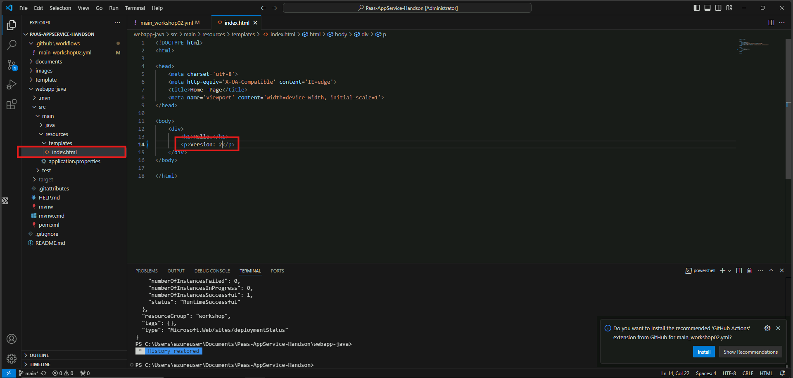


```html
<!DOCTYPE html>
<html>

<head>
    <meta charset='utf-8'>
    <meta http-equiv='X-UA-Compatible' content='IE=edge'>
    <title>Home -Page</title>
    <meta name='viewport' content='width=device-width, initial-scale=1'>
</head>

<body>
    <div>
        <h1>Hello.</h1>
        <p>Version: 2</p>
    </div>
</body>

</html>
```

修正したコードをGitHubにプッシュします。

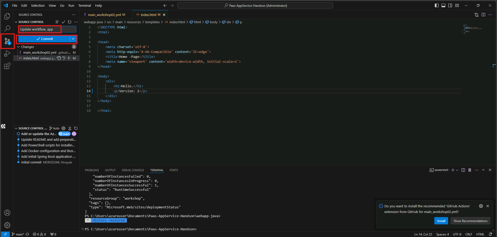
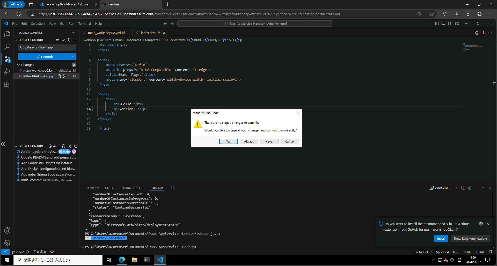
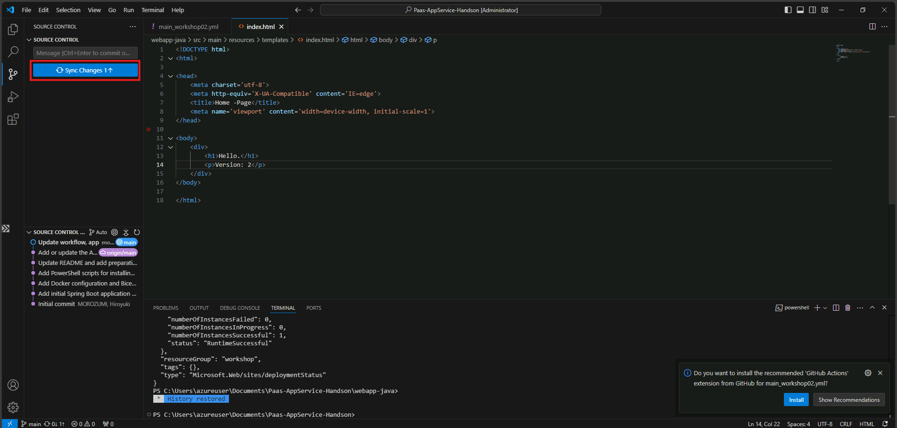
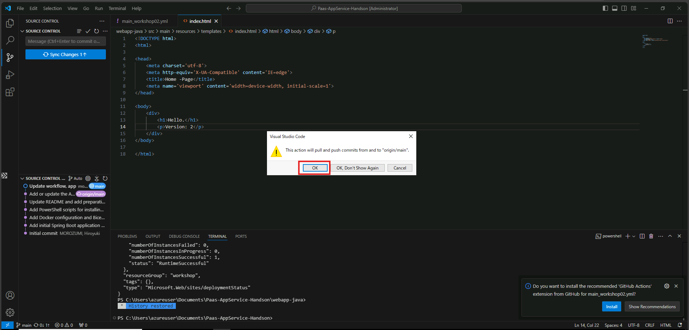
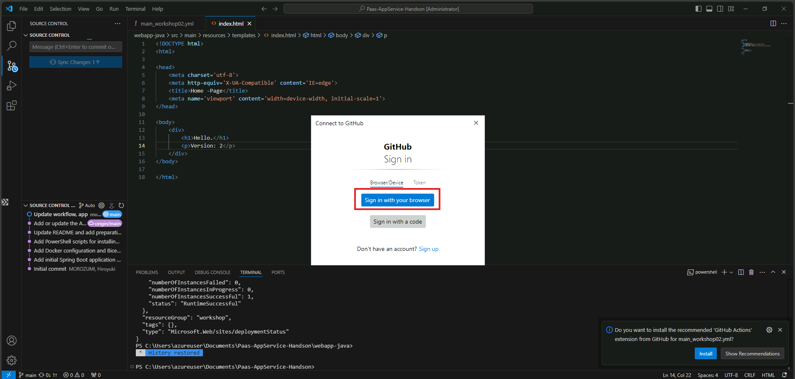
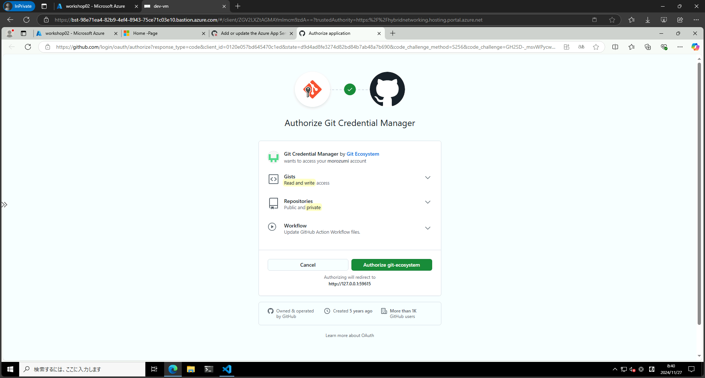
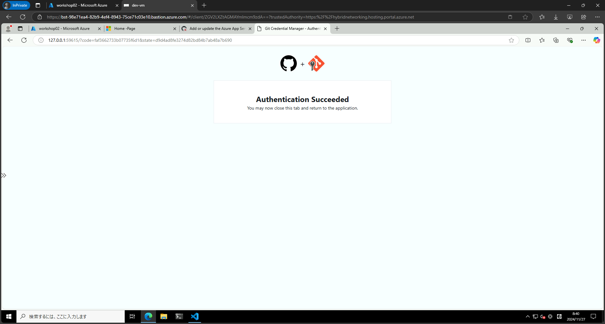


## 4. ワークフローの実行

GitHub Actions でワークフローを手動で実行します。
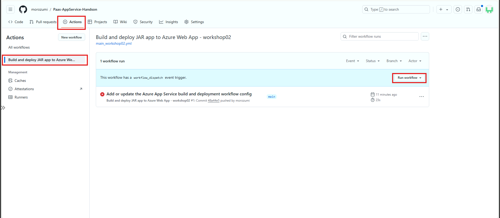
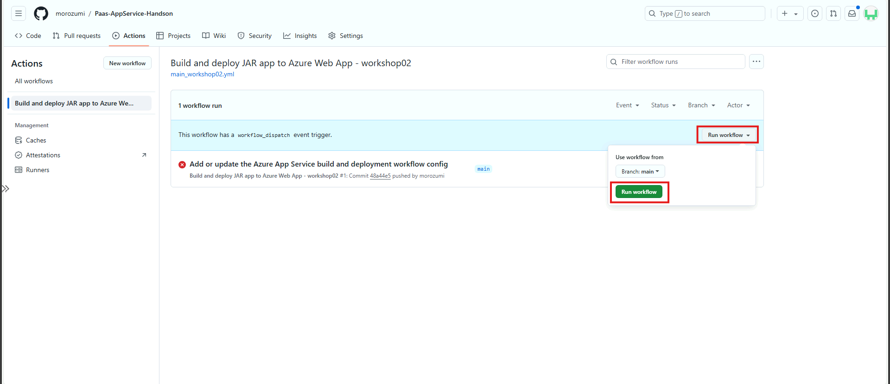

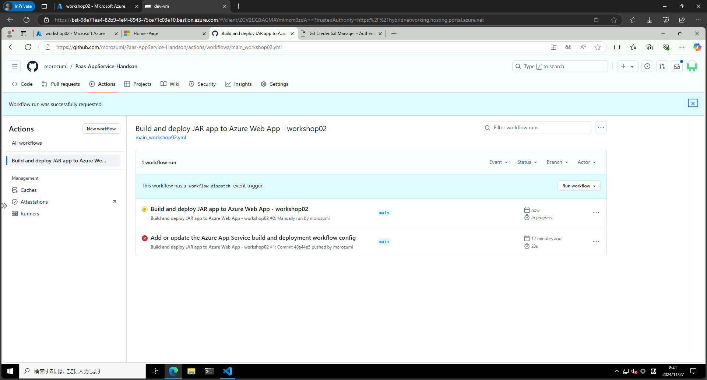
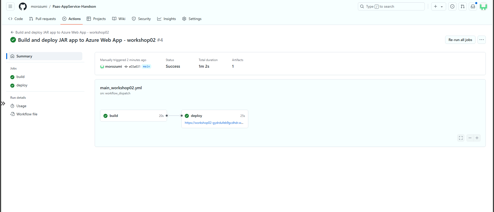

デプロイが完了しました。Webアプリケーションにアクセスして、変更が反映されていることを確認します。

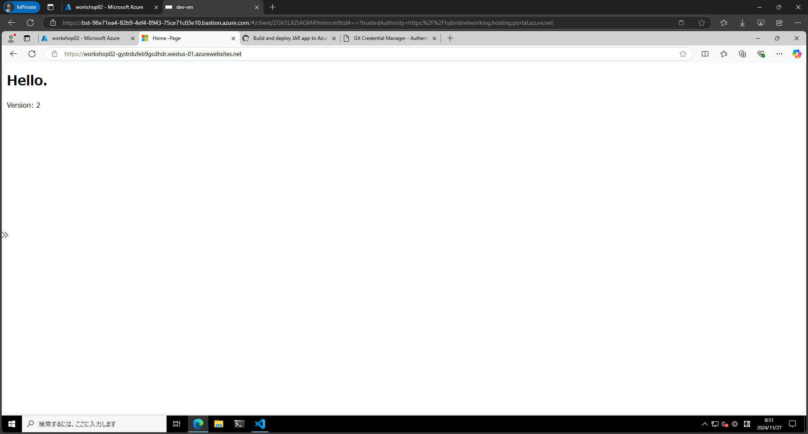

## 参考資料
- [デプロイのベスト プラクティス](https://learn.microsoft.com/ja-jp/azure/app-service/deploy-best-practices)
- [チュートリアル: GitHub Actions を使用して App Service にデプロイし、データベースに接続する](https://learn.microsoft.com/ja-jp/azure/app-service/app-service-sql-asp-github-actions)
- [GitHub Actions を使用した App Service へのデプロイ](https://learn.microsoft.com/ja-jp/azure/app-service/deploy-github-actions?tabs=openid%2Caspnetcore)

---
[Exercise 4 - Azure App Serviceのスロットリングの設定](Exercise%204.md)
