# Azure App Serviceのスロットリングの設定

## 目次

- [1. ステージング環境の準備](#1-ステージング環境の準備)
- [2. ワークフローの修正](#2-ワークフローの修正)
- [3. アプリケーションの更新](#3-アプリケーションの更新)
- [4. ワークフローの実行](#4-ワークフローの実行)
- [5. スワップ操作](#5-スワップ操作)

## 概要

この演習では、Azure App Service のスロット機能を使用して、ステージング環境を構築します。

## 1. ステージング環境の準備

管理ブレードから「デプロイスロット」を選択し、スロットを追加します。「追加」をクリックします。
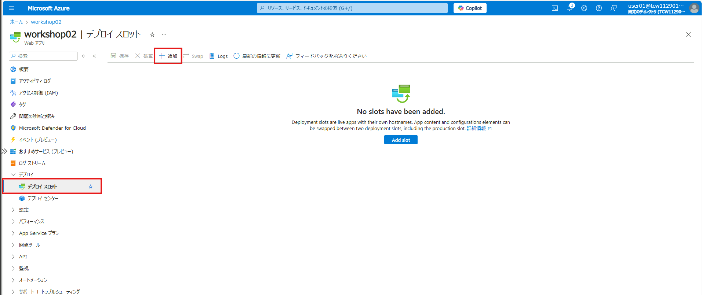

スロットの設定を行います。
- Name: staging
- Clone settings from: 作成したApp Serviceの名前

「Add」をクリックします。
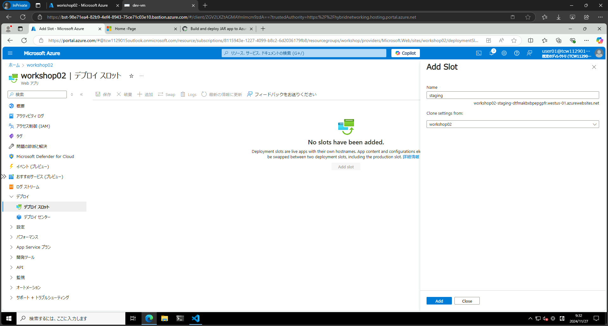

スロットが作成されました。作成されたスロットを選択します。
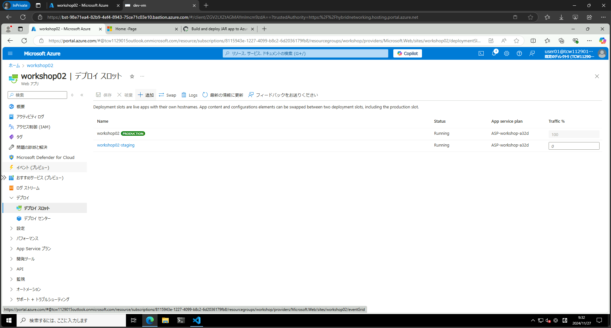

スロットが作成されました。スロットのURLを確認します。
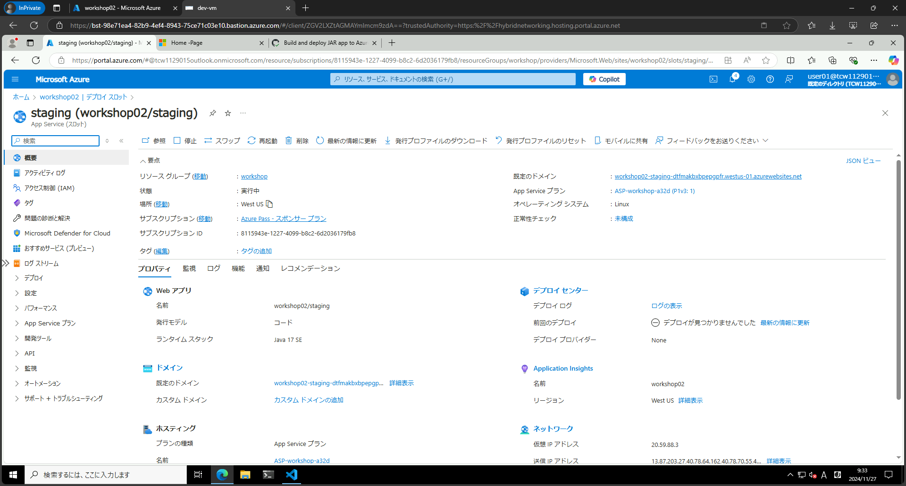

スロットのアプリケーションが表示されました。
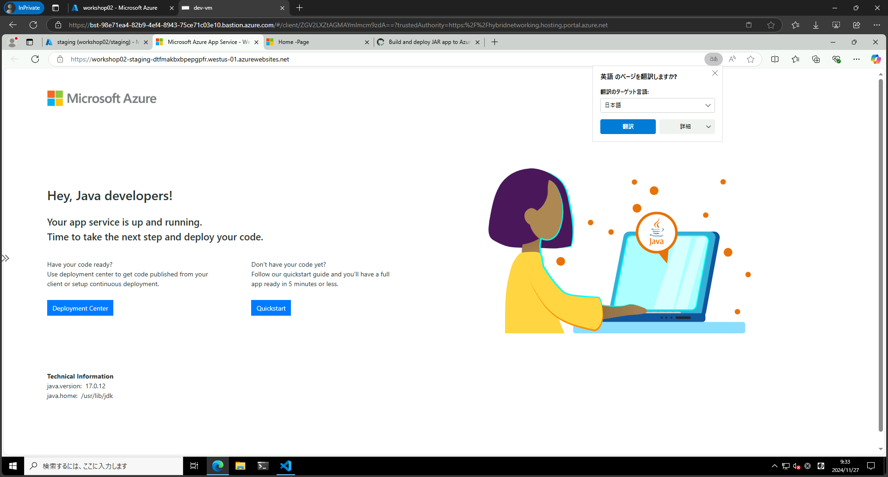

## 2. ワークフローの修正

次に、ワークフローを修正して、スロットにデプロイするように設定します。

GitHubリポジトリに移動し、.github/workflows フォルダ内の yml ファイル（main_xxxxxx.yml）を編集します。

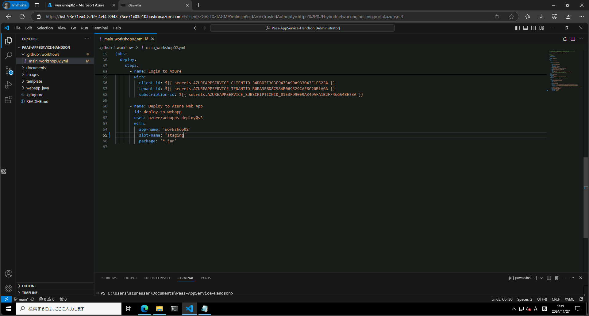

以下の箇所を修正します。

- slot-name: 'staging'

65行目
```yaml
        with:
          app-name: 'workshop02'
          slot-name: 'staging'
          package: '*.jar'
```

<details>
  <summary>全体</summary>

```yaml
# Docs for the Azure Web Apps Deploy action: https://github.com/Azure/webapps-deploy
# More GitHub Actions for Azure: https://github.com/Azure/actions

name: Build and deploy JAR app to Azure Web App - workshop02

on:
  # push:
  #   branches:
  #     - main
  workflow_dispatch:

env:
  APP_PATH: "webapp-java"

jobs:
  build:
    runs-on: ubuntu-latest

    steps:
      - uses: actions/checkout@v4

      - name: Set up Java version
        uses: actions/setup-java@v4
        with:
          java-version: '17'
          distribution: 'microsoft'

      - name: Build with Maven
        run: cd ${{ env.APP_PATH }} && mvn clean install

      - name: Upload artifact for deployment job
        uses: actions/upload-artifact@v4
        with:
          name: java-app
          path: "${{ github.workspace }}/${{ env.APP_PATH }}/target/*.jar"
          # path: '${{ github.workspace }}/target/*.jar'

  deploy:
    runs-on: ubuntu-latest
    needs: build
    environment:
      name: 'Production'
      url: ${{ steps.deploy-to-webapp.outputs.webapp-url }}
    permissions:
      id-token: write #This is required for requesting the JWT
  
    steps:
      - name: Download artifact from build job
        uses: actions/download-artifact@v4
        with:
          name: java-app
      
      - name: Login to Azure
        uses: azure/login@v2
        with:
          client-id: ${{ secrets.AZUREAPPSERVICE_CLIENTID_34DBD3F3C3F9473A99A933043F1F525A }}
          tenant-id: ${{ secrets.AZUREAPPSERVICE_TENANTID_B0BA3F8D8C584B069529CAF8C20B1A6A }}
          subscription-id: ${{ secrets.AZUREAPPSERVICE_SUBSCRIPTIONID_01E3F990E9A349AFA1B2FF46654BE33A }}

      - name: Deploy to Azure Web App
        id: deploy-to-webapp
        uses: azure/webapps-deploy@v3
        with:
          app-name: 'workshop02'
          slot-name: 'staging'
          package: '*.jar'
```

</details>

## 3. アプリケーションの更新

スロットにデプロイするため、アプリケーションを更新します。ステージングには、新たに Version: 3 に更新されたアプリケーションをデプロイします。

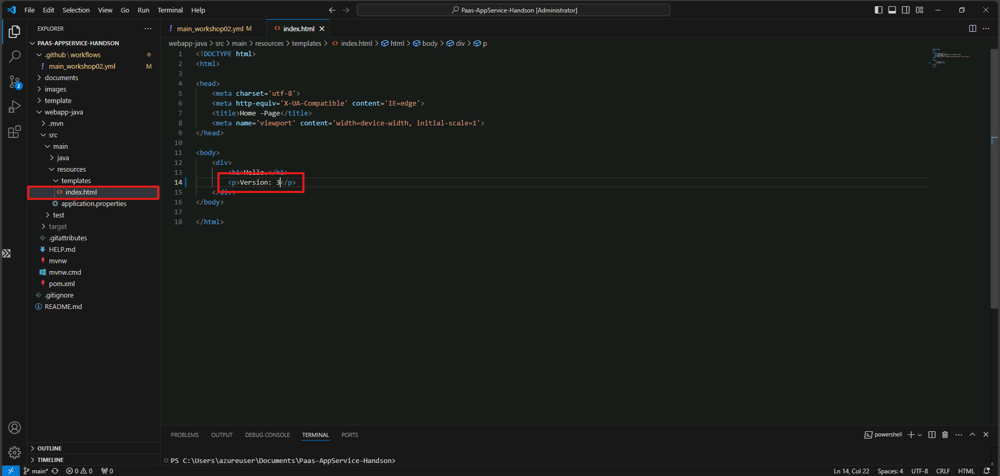

```html
<!DOCTYPE html>
<html>

<head>
    <meta charset='utf-8'>
    <meta http-equiv='X-UA-Compatible' content='IE=edge'>
    <title>Home -Page</title>
    <meta name='viewport' content='width=device-width, initial-scale=1'>
</head>

<body>
    <div>
        <h1>Hello.</h1>
        <p>Version: 3</p>
    </div>
</body>

</html>
```

修正したファイルをGitHubリポジトリにプッシュします。

## 4. ワークフローの実行

GitHubリポジトリに移動し、Actionsタブを選択します。
Actionsタブ内のワークフローを選択し、Run workflowをクリックします。

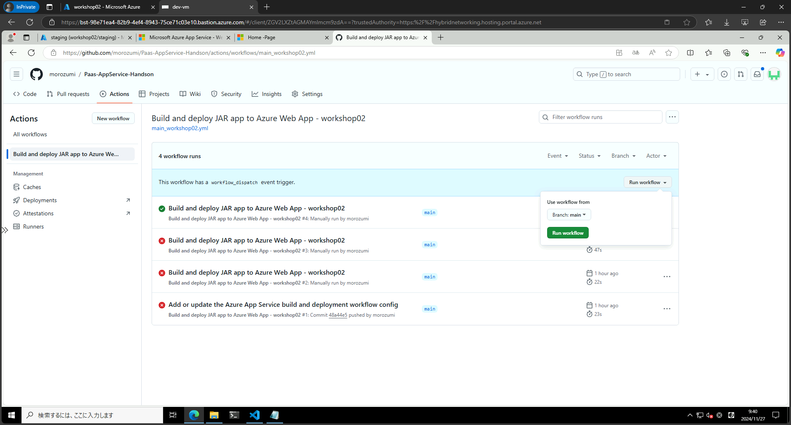

ワークフローが実行されます。 Build と Deploy のジョブが実行され、ステージングスロットにデプロイされます。
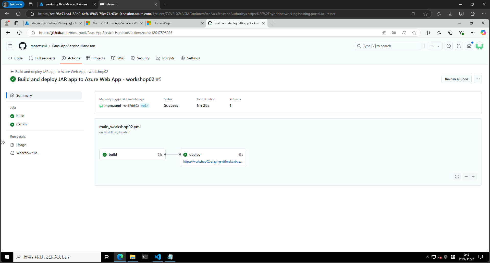

デプロイが完了しました。ステージングスロットのURLにアクセスして、アプリケーションが更新されたことを確認します。
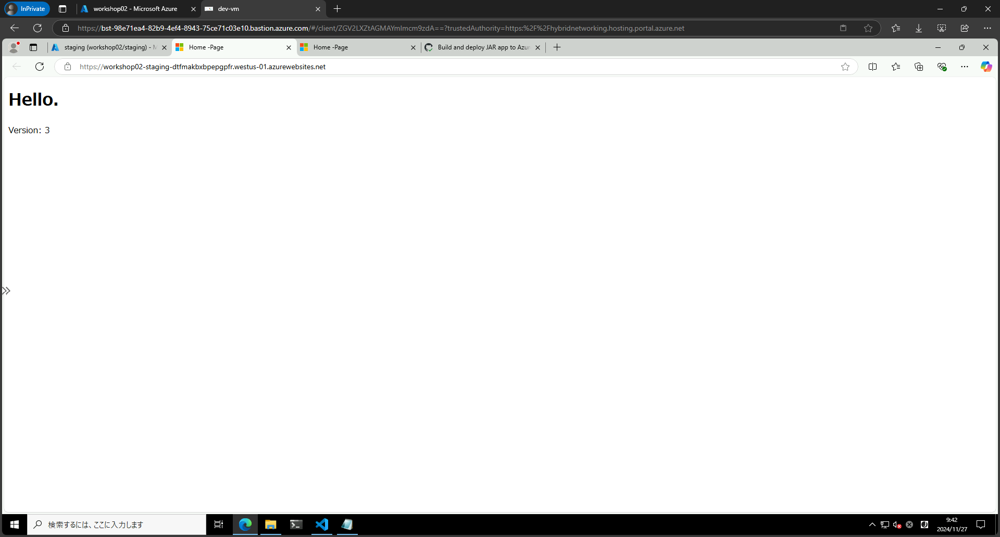

## 5. スワップ操作

ステージングスロットのアプリケーションが正常に動作していることを確認したら、本番環境にスワップします。
管理ブレードから「デプロイスロット」を選択し、「Swap」をクリックします。

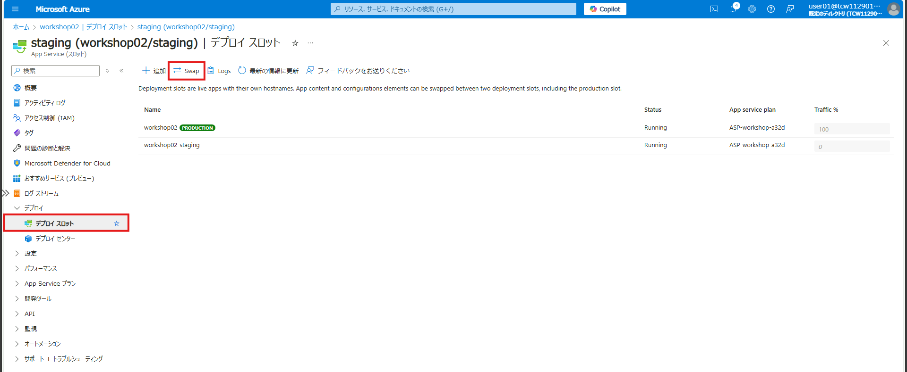

スワップの設定を行います。
- Source: stagingを選択
- Target: productionを選択

「Start Swap」をクリックします。
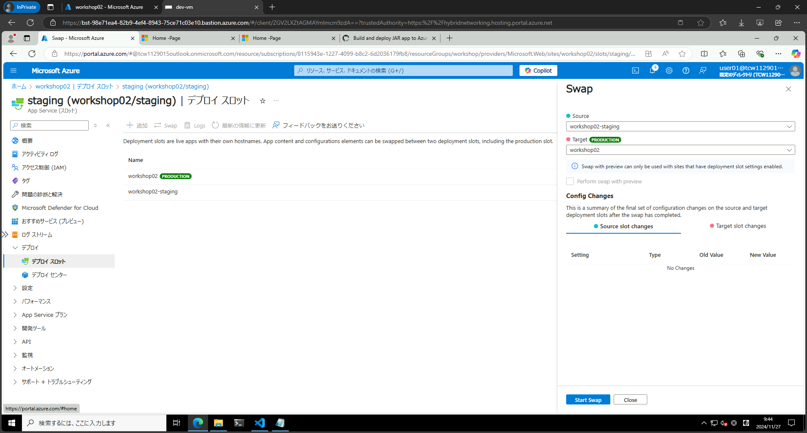

スワップが完了しました。本番環境のURLにアクセスして、アプリケーションが更新されたことを確認します。
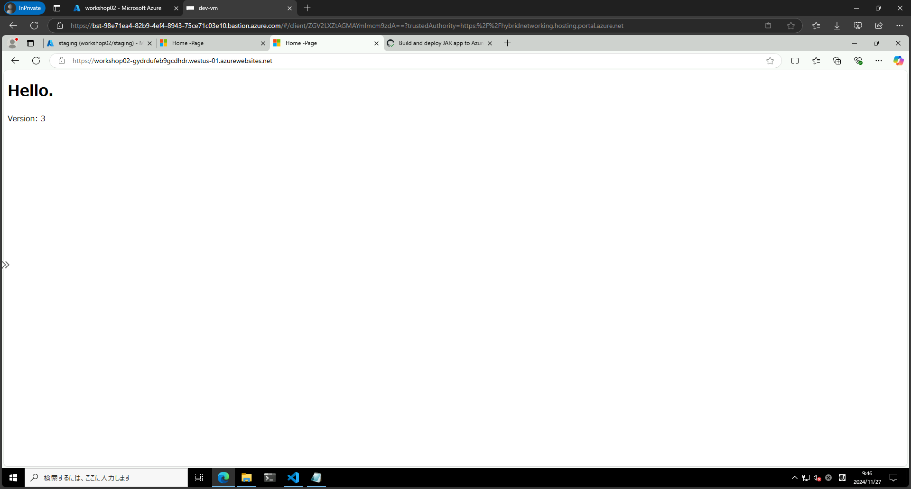

ステージングには、本番環境で動いていたアプリケーションがデプロイされています。もし本番環境に不具合があった場合、ステージングにスワップすることで、すぐに本番環境を元に戻すことができ不具合不具合
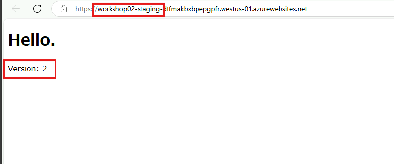

## 参考資料

- [Azure App Service でステージング環境を設定する](https://learn.microsoft.com/ja-jp/azure/app-service/deploy-staging-slots?tabs=portal)

---

[Exercise 5 - FrontDoor + App Serviceの構成](./documents/Exercise%205.md)