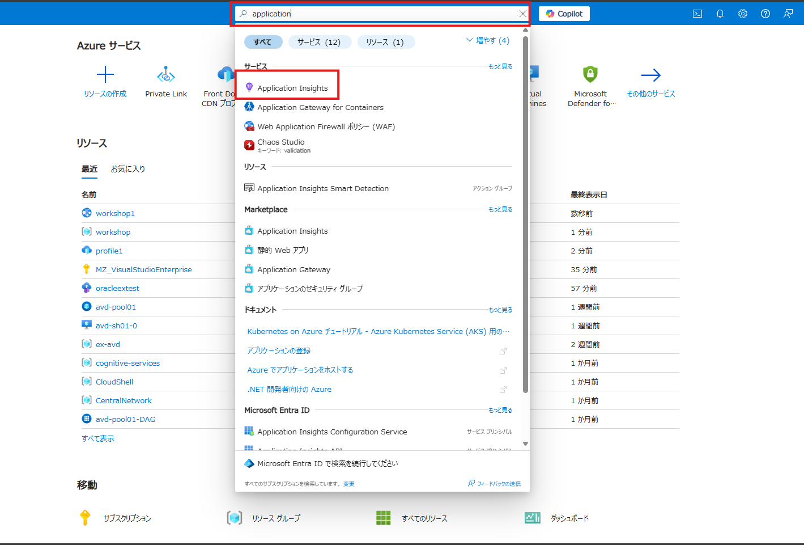
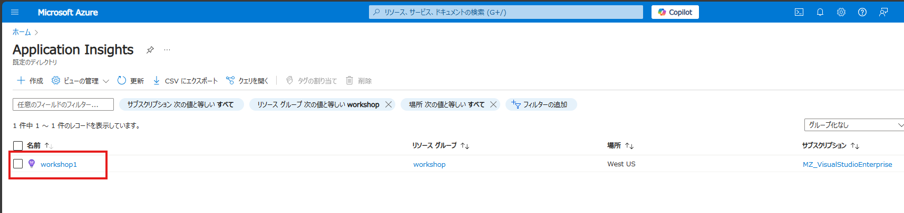
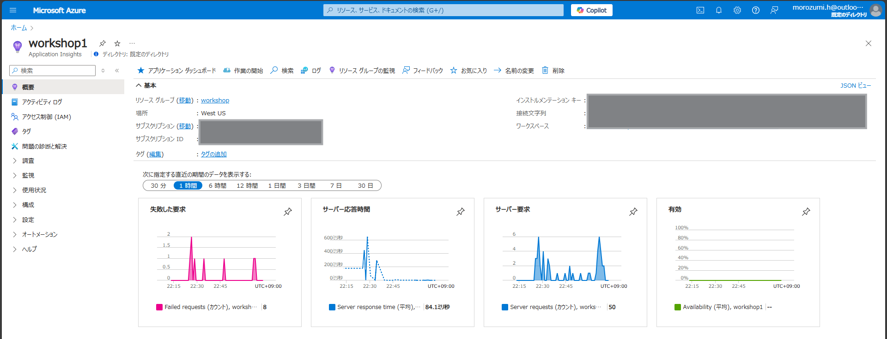
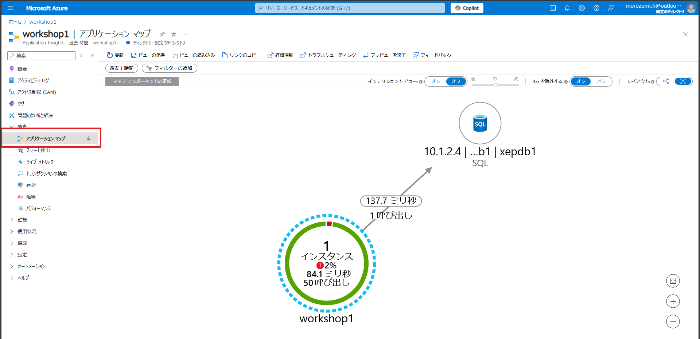
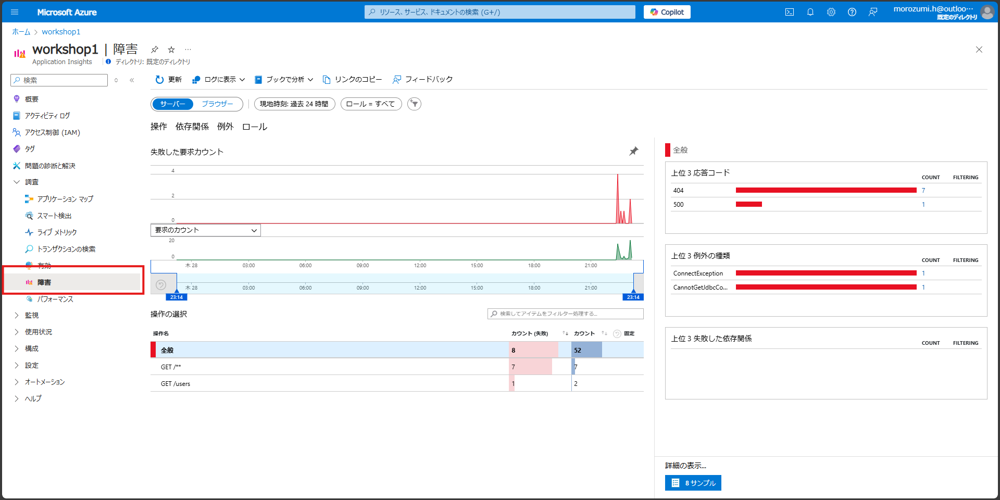
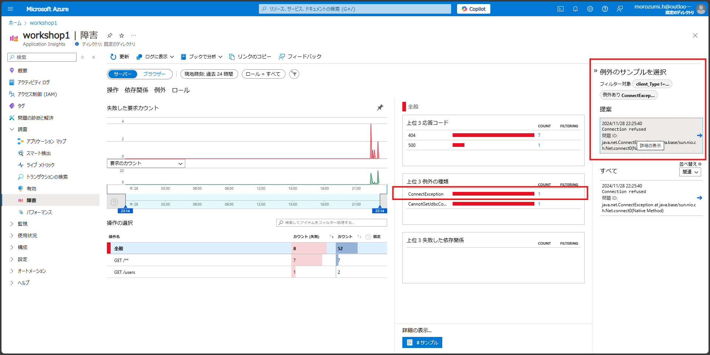
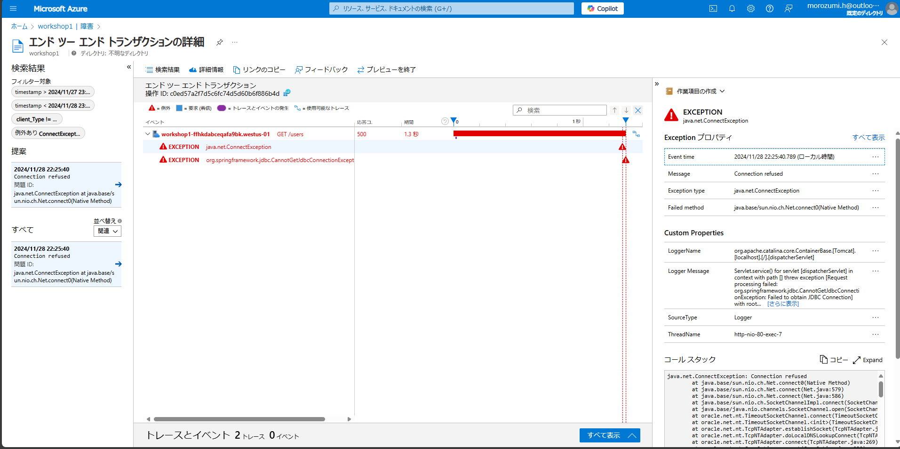

# Application Insightsの設定

## 概要

この演習では、Application Insightsを使用して、Azure App ServiceのWebアプリケーションのパフォーマンスと利用状況を監視する方法を学びます。

## 確認手順

検索窓から「Application Insights」を検索し、サービスを選択します。

一覧に表示されたApplication Insightsのリソースを選択します。

Application Insightsの概要画面が表示されます。

「アプリケーション マップ」を選択します。

「障害」を選択します。

## 参考資料

- [Azure App Service の監視](https://learn.microsoft.com/ja-jp/azure/app-service/monitor-app-service)
- [Application Insights の概要](https://learn.microsoft.com/ja-jp/azure/azure-monitor/app/app-insights-overview)

---
[Exercise 7 - Easy Authによる認証](./documents/Exercise%207.md)
