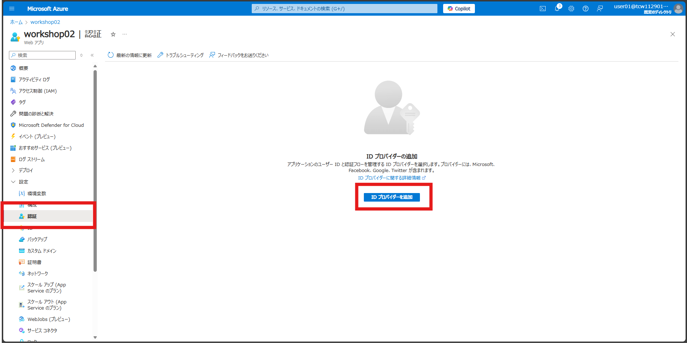
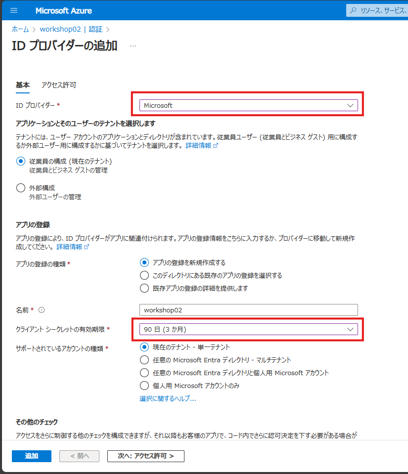
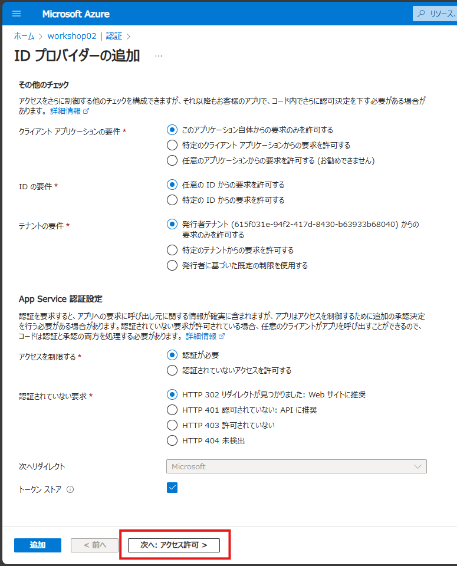
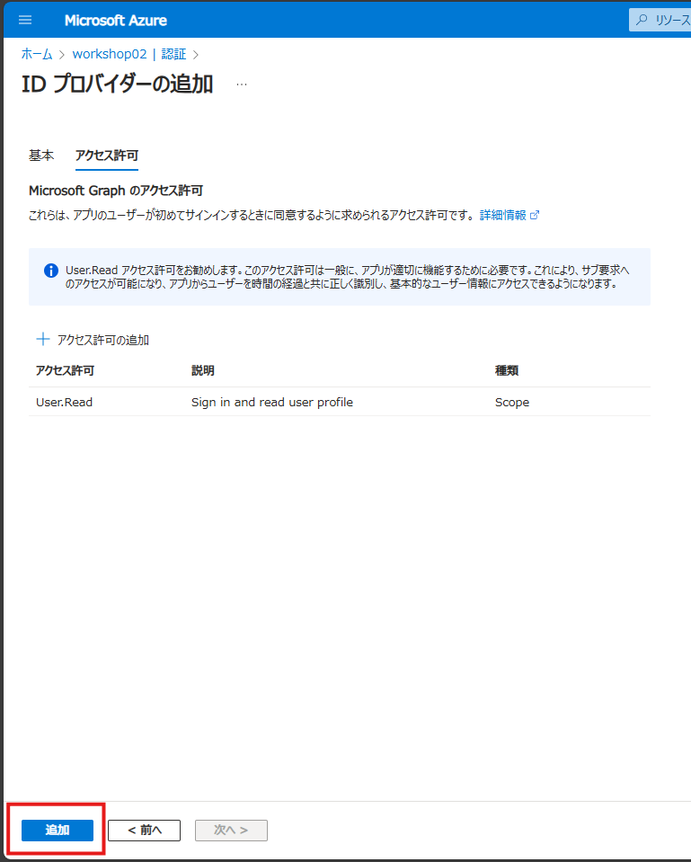
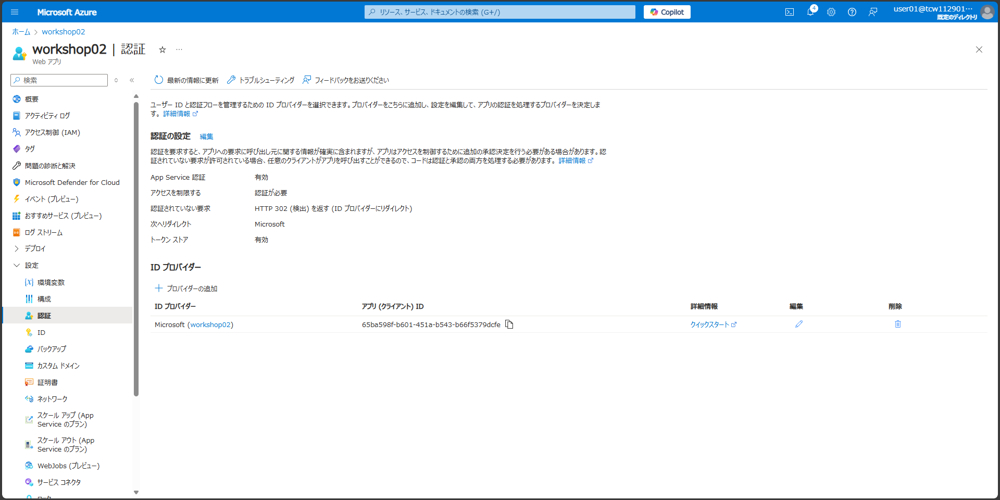
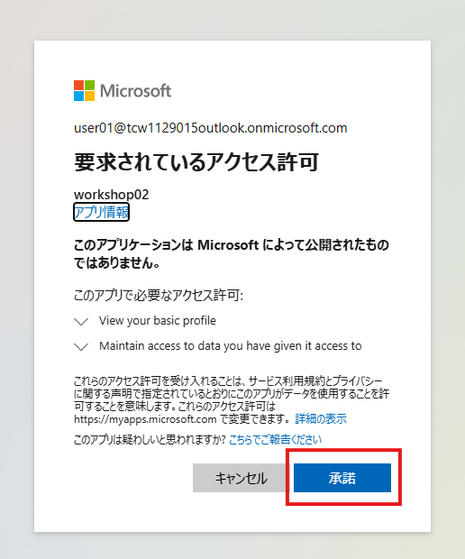
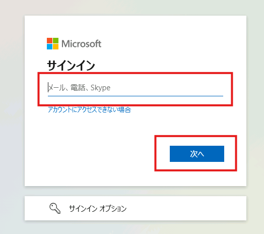
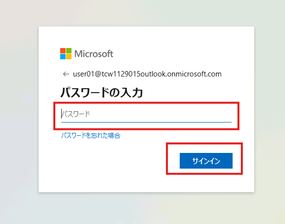

# Easy Authによる認証を有効にする

## 概要

この演習では、Azure App Service において、Easy Auth による認証を有効にする手順を学びます。

## 設定手順

App Serviceの管理ブレードから「認証」を選択し、「ID プロバイダーを追加」をクリックします。

### ID プロバイダーの追加

ID プロバイダーの追加画面で、以下の設定を行います。

- ID プロバイダー: Microsoft
- クライアント シークレットの有効期限: 90日（3か月）

設定が完了したら、「追加」をクリックします。

### アクセス許可の設定

特に変更なし。そのまま「追加」ボタンをクリックします。

ID プロバイダーが追加されたことを確認します。

それでは、Webアプリケーションにアクセスしてみましょう。Easy Auth による認証が有効になっているため、アクセスすると、Microsoft アカウントでの認証が求められます。

無事に認証が完了すると、Webアプリケーションにアクセスできることが確認できます。

## 参考資料

- [Azure App Service および Azure Functions での認証と承認](https://learn.microsoft.com/ja-jp/azure/app-service/overview-authentication-authorization)
- [認証のシナリオと推奨事項](https://learn.microsoft.com/ja-jp/azure/app-service/identity-scenarios)
- [Microsoft Entra サインインを使用するように App Service アプリまたは Azure Functions アプリを構成する](https://learn.microsoft.com/ja-jp/azure/app-service/configure-authentication-provider-aad?tabs=workforce-configuration)